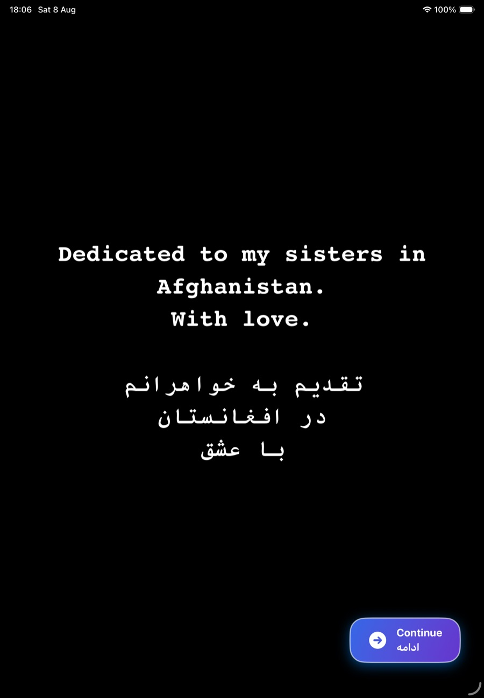
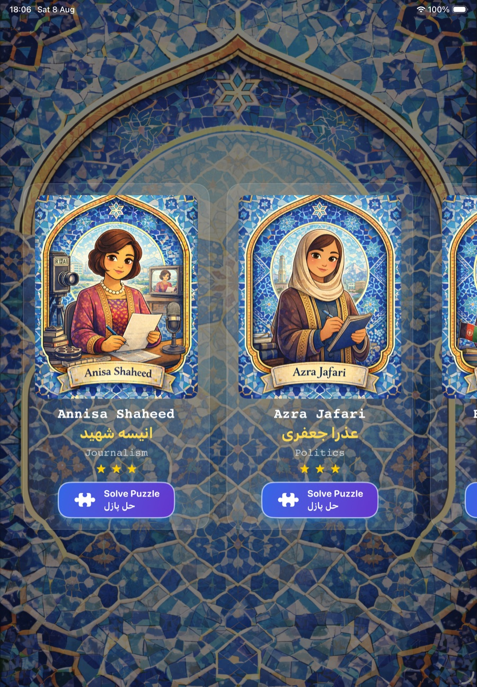
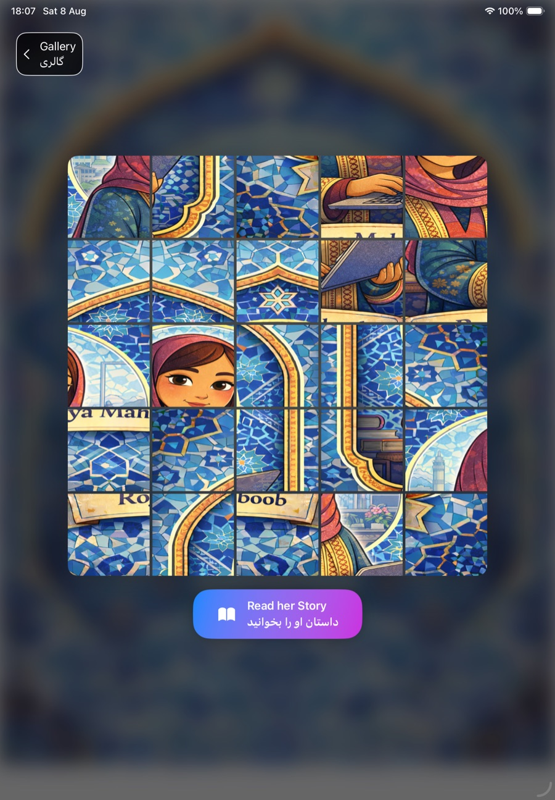
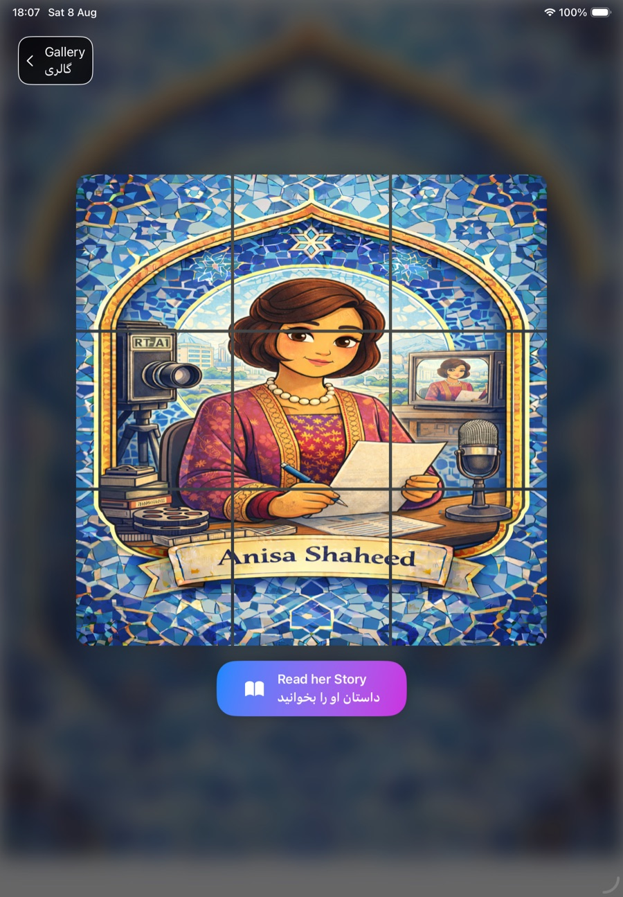
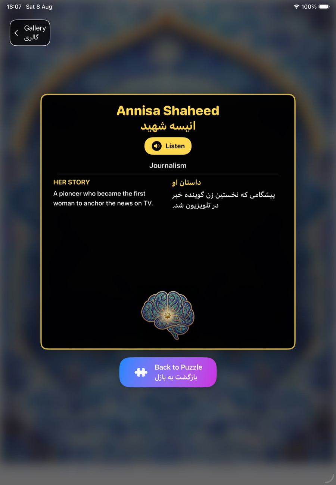

# Lapis Minds 💎

*Puzzles that piece together the stories of Afghan women who shaped history.*

Dedicated to my sisters in Afghanistan, with love.


---

## Table of Contents

- [About](#about)
- [Screenshots](#screenshots)
- [Features](#features)
- [Tech Stack](#tech-stack)
- [Project Structure](#project-structure)
- [Getting Started](#getting-started)
- [How It Works](#how-it-works)
- [Accessibility & Localization](#accessibility--localization)
- [Roadmap](#roadmap)
- [Author](#author)
- [License](#license)
- [Acknowledgments](#acknowledgments)

---

## About

**Lapis Minds** is an iPad/iPhone puzzle game built with SwiftUI that introduces players to 18 Afghan women — journalists, poets, doctors, engineers, and political leaders — who made history in fields ranging from education to human rights.

Each woman is represented by a photo puzzle. Solving the puzzle reveals a bilingual (English/Farsi) biography card that can also be **read aloud** in both languages using text-to-speech. The goal is to combine a lightweight, satisfying puzzle mechanic with real educational content, so players walk away having *learned something* about people whose stories are rarely told in mainstream media.

This project was built as a submission for the **Swift Student Challenge**.

## Screenshots

<table>
  <tr>
    <td align="center"><br/><sub>Bilingual dedication</sub></td>
    <td align="center"><br/><sub>Gallery (18 women)</sub></td>
    <td align="center"><br/><sub>Solving the puzzle</sub></td>
    <td align="center"><br/><sub>Puzzle solved</sub></td>
    <td align="center"><br/><sub>Bio + narration</sub></td>
  </tr>
</table>

## Features

- 🧩 **Photo puzzle gameplay** — each portrait is procedurally sliced into an *n × n* grid (grid size scales with a per-person `difficulty` value) and solved with drag-and-drop, complete with haptic feedback and nearest-cell snapping.
- 🔄 **3D flip card** — after solving (or at any time), the puzzle flips over in 3D to reveal a biography card.
- 🌍 **Bilingual content (English / Farsi)** — every name and biography is presented side-by-side in English and Farsi, with correct right-to-left text layout for Farsi.
- 🔊 **Text-to-speech narration** — tap "Listen" to hear each biography read aloud, switching automatically between English and Farsi voices.
- 🎨 **Horizontally scrolling gallery** — browse all 18 women with star ratings that reflect puzzle difficulty.
- ✍️ **Typewriter-style onboarding** — an animated dedication message introduces the app before the gallery loads.
- 🎵 **Background music** with safe playback handling (won't restart music if it's already playing).

## Tech Stack

| Layer | Technology |
|---|---|
| UI | SwiftUI, `NavigationStack`, `GeometryReader`, custom `DragGesture` |
| Image processing | Core Graphics (`CGImage` cropping) for puzzle-piece generation |
| Audio | `AVFoundation` — `AVAudioPlayer` (music) and `AVSpeechSynthesizer` (narration) |
| Haptics | `UIImpactFeedbackGenerator` |
| Platform | iOS 16+, built as a Swift Playgrounds app (`.swiftpm`) |
| Language | Swift 6 |

## Project Structure

```
swiftchallenge.swiftpm/
├── Package.swift              # Swift Playgrounds app manifest (iOS 16+, Swift 6)
├── MyApp.swift                # App entry point (@main)
├── ContentView.swift          # Root view, launches onboarding
├── OnboardingView.swift       # Animated dedication + entry point
├── GalleryView.swift          # Horizontal scroll gallery of all heroes
├── Data.swift                 # Scholar model + the 18 heroes' data
├── PuzzleLogic.swift          # PuzzleEngine — slices the portrait into pieces
├── PuzzleBoardView.swift      # Draggable puzzle grid + win detection
├── PuzzleGameView.swift       # Puzzle screen container + 3D flip control
├── HeroBioView.swift          # Hero biography card (front of the flip)
├── CardBackBioView.swift      # Bilingual biography card (back of the flip)
├── AudioManager.swift         # Background music playback
├── Speech.swift               # StorySpeaker — bilingual text-to-speech
├── Tula.mp3                   # Background music track
└── Assets.xcassets/           # Portraits, background, icons
```

## Getting Started

This project is a **Swift Playgrounds app** (`.swiftpm`), so the easiest way to run it is:

1. Install [Swift Playgrounds](https://apps.apple.com/app/swift-playgrounds/id908519492) on your iPad or Mac.
2. Clone this repository:
   ```bash
   git clone https://github.com/aaetos724/Lapis-Minds.git
   ```
3. Open `swiftchallenge.swiftpm` — it will launch directly in Swift Playgrounds.
4. Press **Run**.

You can also open the `.swiftpm` folder directly in **Xcode 15+** (File → Open) and run it on an iOS 16+ simulator or device.

No external dependencies or package managers are required — everything uses first-party Apple frameworks.

## How It Works

1. **Gallery** — `GalleryView` lists all `Scholar` entries from `Data.swift` in a horizontally scrolling `LazyHStack`.
2. **Puzzle generation** — when a puzzle is opened, `PuzzleEngine.createPuzzle` slices the hero's portrait into an *n × n* grid using `CGImage.cropping(to:)`, where *n* is that hero's `difficulty` value (3–5).
3. **Solving** — `PuzzleBoardView` handles drag gestures: as a piece is dragged, its distance to every other cell center is measured, and it swaps with the nearest cell within a snap threshold. A win is detected by comparing the current piece order to the original order.
4. **Reveal** — `PuzzleGameView` controls a `rotation3DEffect`-based flip between the puzzle board and `CardBackBioView`, which shows the bilingual biography and a "Listen" button wired to `StorySpeaker`.

## Accessibility & Localization

- All Farsi text uses `.environment(\.layoutDirection, .rightToLeft)` for correct RTL rendering rather than simple text alignment.
- Biographies are available as **audio** in addition to text, via `AVSpeechSynthesizer` with locale-specific voices (`en-US` / `fa-IR`).

**Known gap / next step:** VoiceOver labels are not yet implemented for puzzle pieces and icon-only buttons — see [Roadmap](#roadmap).

## Roadmap

- [ ] Add `accessibilityLabel`/`accessibilityHint` to puzzle pieces and icon buttons for VoiceOver support
- [ ] Persist puzzle completion progress across sessions
- [ ] Recalculate puzzle board layout on device rotation / size class changes
- [ ] Add a visible error/retry state if a hero's image fails to load
- [ ] Unit tests for `PuzzleEngine` (grid slicing) and win-condition logic
- [ ] Add more heroes and expand into other regions/fields


## Author

**Elisa A.**
- GitHub: [@aaetos724](https://github.com/aaetos724)

## License

This project is licensed under the MIT License — see [LICENSE](LICENSE) for details.

## Acknowledgments

- Built as part of the **Swift Student Challenge**.
- Dedicated to the women of Afghanistan whose stories inspired this project.
